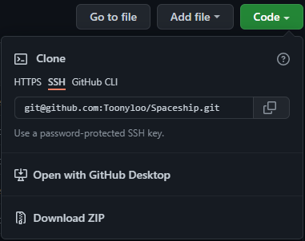

# Spaceship
A simple PvP spaceship game where you control a spaceship and try to shoot down the opponent ship, controlled either by another player or an AI.

# Controls 
## Player 1:
W A S D: Movement

Space: Shoot Laser

F: Shoot Bomb

F (while bomb is in the air): Detonate Bomb

## Player 2:
← ↑ → ↓: Movement

Right Shift: Shoot Laser

Slash: Shoot Bomb

Slash (while bomb is in the air): Detonate Bomb

# Download
Download this repo as a ZIP file by clicking on the Download ZIP button on the code dropdown menu.

## Option 1:
If you have Python installed on your system, install pygame by typing `pip install pygame` into your terminal then run main.py.

## Option 2 (Windows Systems Only):
If you don't, you can run the Spaceship.exe file in the ZIP folder to play the game, but it may be detected as a virus by your antivirus.